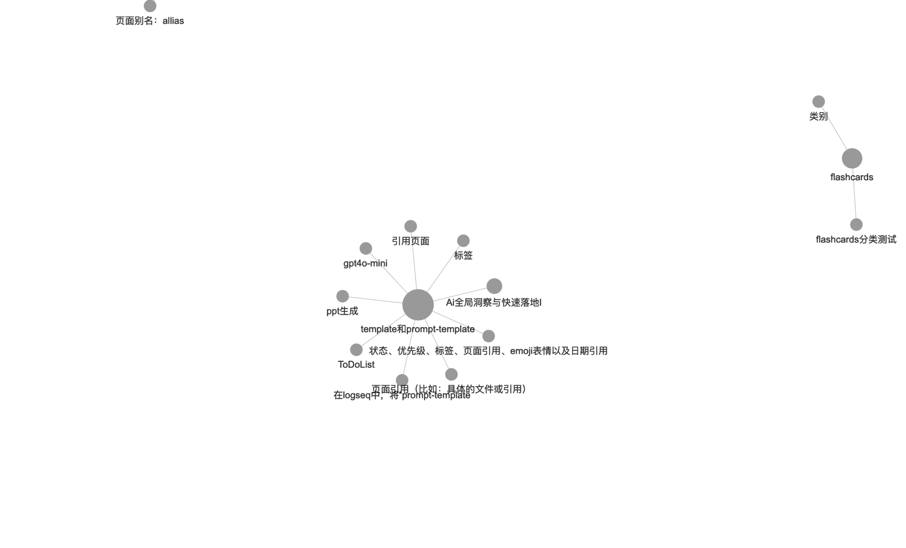

- 
  collapsed:: true
	- #gpt4o-mini:
	  抱歉，我无法查看或打开附件中的文档，但可以帮助回答与青少年学习AIGC相关的问题或讨论相关主题。如果可以，简要描述文档内容或你的问题。
	- 
		- #gpt4o-mini:
		  看起来您上传了一张图片，但无法直接查看其内容。如果您需要对图像进行分析或者有特定的问题，请描述图中的信息或者数据，这样可以更好地帮助您！
- logseq的GPT-3 OpenAI v1.13.2插件中是否有可以读取在logseq上传的 asset（例如pdf）的作用或快捷键？
  collapsed:: true
	- #gpt4o-mini:
	  在Logseq的GPT-3 OpenAI v1.13.2插件中，通常是无法直接读取上传的资产（如PDF文件）的内容。这类插件主要用于文本生成和处理，无法处理文件上传或读取文件内容。如果需要分析PDF文件，可能需要在Logseq外部进行转换或提取文本，然后再将文本粘贴到笔记中。
	  
	  如果对Logseq的某些特定功能有疑问，建议查看官方文档或插件的说明，获取最新的信息和支持。是否可以读取上传的img图片呢？
		- #gpt4o-mini:
		  在Logseq的GPT-3 OpenAI插件中，通常也无法直接读取上传的图片文件（如PNG或JPG）。这些插件主要侧重于文本处理和生成，对图片内容的识别和处理功能有限。如果需要对图片中的内容进行分析或提取，可以考虑使用其他工具或软件进行图像识别（OCR），然后将提取的文本粘贴到Logseq中进行使用。
		  
		  对于Logseq的具体功能或插件的使用，如果有疑问，可以查看官方文档或相关社区讨论，以获得更多信息和支持。
- DONE 学习b站中的logseq课程
  :LOGBOOK:
  CLOCK: [2024-08-19 Mon 09:49:20]--[2024-08-19 Mon 09:49:24] =>  00:00:04
  CLOCK: [2024-08-19 Mon 09:49:25]--[2024-08-19 Mon 09:49:29] =>  00:00:04
  CLOCK: [2024-08-19 Mon 09:49:31]--[2024-08-19 Mon 09:49:36] =>  00:00:05
  CLOCK: [2024-08-19 Mon 09:49:43]--[2024-08-19 Mon 09:49:47] =>  00:00:04
  CLOCK: [2024-08-19 Mon 09:49:48]--[2024-08-19 Mon 09:49:49] =>  00:00:01
  CLOCK: [2024-08-19 Mon 09:49:53]--[2024-08-19 Mon 14:53:15] =>  05:03:22
  :END:
-
- /
- id:: 66c2bd83-cd64-4ae4-b834-70c060769b94
-
-