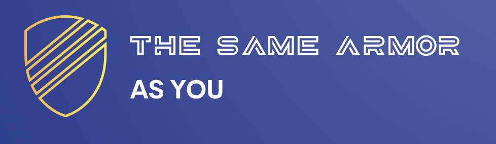
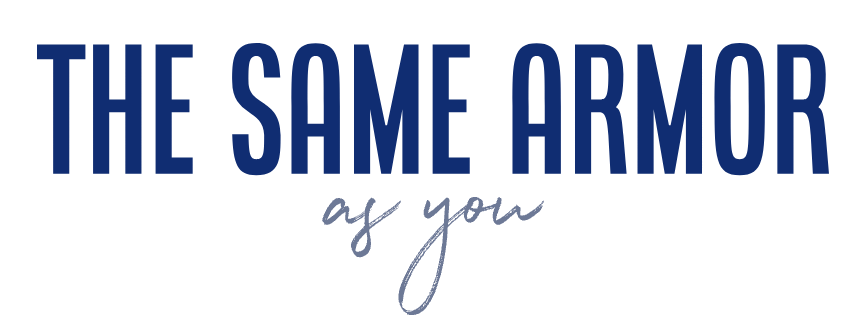
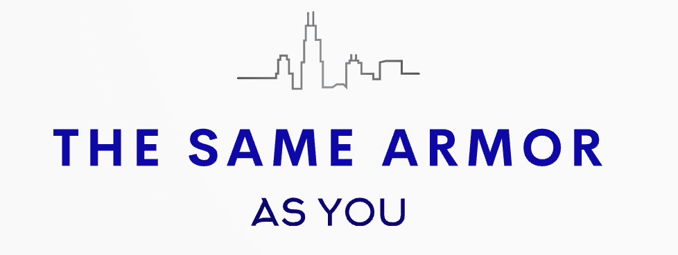

- 从大语言模型LLM到通用人工智能AGI（看清站位）
	- 第一点（本课价值）
	- 第二点（生成式AI简史）
	- 第三点（大语言模型LLM（三项技术突破））
	- 第四点（AGI（通用人工智能））
	- 第五点（LLM天花板）
	- 第六点（生成式时代人工智能发展的特点）
	- 第七点（大模型的底座作用及AI对各行业的影响）
- 国内外AI现状与大众困惑（认清全局）**
	- **第一点** ** 全球：百家争鸣**
		- OpenAI Google Meta  Anthropic Nvidia Mistral HuggingFace Microsoft... 这几家公司在大模型方面发展的侧重点，行业地位，优缺点及用户评价
			- OpenAI成立于2015年，致力于推动人工智能的发展，并提供开放的AI技术。Google是全球知名的科技公司，早在2012年开发了Google Brain项目，为人工智能研究奠定了重要基础。Meta（前身为Facebook）通过其在社交网络和人工智能领域的积累，正在积极探索AI技术在社交媒体和虚拟现实领域的应用。Anthropic是一家人工智能技术公司，专注于开发具有超人类水平的通用人工智能。NVIDIA是一家专注于视觉计算和人工智能领域的公司，在GPU加速计算方面具有较大优势。Mistral是一家致力于边缘计算和人工智能芯片研发的公司，其产品在物联网和自动驾驶领域有广泛应用。Hugging Face是一家为开发者提供自然语言处理模型和工具的初创公司，被广泛应用于对话系统和文本分析。Microsoft作为全球知名的科技巨头，通过Azure平台不断推动着人工智能技术的应用和发展。这些公司在人工智能方面具有良好的研发基础和技术储备，但也面临着隐私保护、数据安全等方面的挑战。同时，人工智能的发展也需要更多的伦理规范和社会责任的考量。
		- [[gpt4o-mini]]:全球人工智能领域竞争激烈，各大公司纷纷在技术、应用和市场上争相发力。以下是一些主要参与者的情况：
			- 1. **OpenAI**：继续推动语言模型的前沿，致力于提升模型的理解和生成能力，同时关注安全性和伦理问题。
			- 2. **Google**：通过其Transformers架构和AiBard等产品，加速自然语言处理及图像处理领域的研究与应用。
			- 3. **Meta**：专注于社交网络和虚拟现实，正在不断通过AI技术增强用户体验，并进行知识图谱和社交图谱的构建。
			- 4. **Anthropic**：专注于AI安全与可控性，致力于开发更为安全的AI系统，以确保其技术不被滥用。
			- 5. **Nvidia**：在图形处理单元（GPU）市场的领先地位使其成为AI训练和推理的重要基础设施提供者，同时也在深度学习模型上发挥关键作用。
			- 6. **Mistral**：新兴的公司，专注于构建强大的开放源码模型，推动社区合作和创新。
			- 7. **HuggingFace**：提供了友好的工具和平台，使开发者能够容易地构建和分享机器学习模型，促进了开放科学和技术的普及。
			- 8. **Microsoft**：通过与OpenAI的合作，强化其在云计算中的AI服务，同时继续推进基于AI的产品创新。
			- 在这个快速发展的领域，各公司不断推出新的技术和产品，推动全球人工智能的进步和应用落地。
	- **第** **二** **点** ** ** **国内：群雄争霸**
		- 国内------百度：文心一言；阿里：通义千言；腾讯 元宝；抖音：豆包；天工AI；Kimi；中国国内这几家大模型的开发者公司，定位，行业地位，优缺点及用户评价；
		- 国内各家优缺点
			- 百度文心一言的优点包括智能搜索、方便查询，但缺点可能是信息准确性不够。用户评价普遍认为它的搜索速度快，但有时候搜索结果可能不够精准。
			- 阿里通义千言的优点可能在于语义理解较为准确，但可能存在难以处理复杂语境的缺点。用户评价可能体现出认为它能够准确理解用户意图，但在处理一些复杂问题时可能不够理想。
			- 腾讯元宝在智能理解和交互体验方面可能有优势，但在一些专业领域的知识覆盖上可能存在不足。用户评价可能会表达出它的交互体验流畅，但在某些专业领域可能不够全面。
			- 天工AI可能具备自然语言生成和智能问答的优势，但在处理复杂问题时可能存在一定局限性。用户评价可能会体现出对其自然语言生成能力的认可，但也会意识到在处理复杂问题上的局限。
			- 抖音豆包可能在个性化推荐和用户体验上具备优势，但可能面临内容准确性和深度的挑战。用户评价可能会反映出它的个性化推荐比较符合用户口味，但也会意识到其中存在的内容深度问题。
	- **第** **三** **点** ** ** **普通人：如何借力Ai 祝我一臂之力（需求）**
	- **第** **四** **点** ** ** **最大问题：陷入局部而不自知；**
	- **第** **五** **点** ** ** **困惑点&坑点（如何选择？如何避坑？如何用好？）**
	-
- 看清全局并快速上手的最佳策略
	- **第一点** ** ** **国内外众多模型评测**
		- 著名的llama家族
	- **第** **二** **点** ** ** 国内外众多应用
		- 乱花渐欲迷人眼
	- **第** **三** **点** ** ** **到底如何选择（亲测+诸多权威人士推荐/评测 并行）**
	- **第****四****点 ****如何现场测试（提示词的写法+要点；结合自己掌握的知识库的测评问题设置）**
- **现场测评：侧重推理和搜索能力** ****
	- **第** **一** **点** ** 经典问题**
	- **第****二****点 ****现实问题---prompt调优**
	- 第三点 实时问题
	- **第** **四** **点 复杂问题**
	- **第** **五** **点 专业问题**
	- ---
	-
-
-
-
-
-
-
- /gpt-page   gpt-3.5-turbo的总结：
- 《2024 AI全局洞察与快速落地》的内容看起来非常丰富多样。包括大型语言模型LLM、通用人工智能AGI，以及国内外各家公司在人工智能领域的探索和应用情况。另外，也提到了普通人如何借助人工智能，以及在面对人工智能应用时存在的困惑点和坑点。对于要选择何种模型以及如何进行有效测试也进行了说明。此外还介绍了关于向量化和Embedding的概念、作用和语义理解等内容。这些都是非常值得研究和关注的话题。
-
- /gpt-page   gpt-4o-mini的总结：
- 内容涵盖了当前人工智能领域的多个关键方面，包括大型语言模型（LLM）、通用人工智能（AGI）、国内外公司在AI领域的最新进展，以及普通人在实际应用中如何有效利用AI技术。通过分析不同的技术突破和市场现状，本课程旨在帮助受众清晰认识人工智能的全局，并提供快速上手的策略。
  
  ### 关键点总结：
  
  1. **智能模型的发展**：大语言模型（LLM）的技术突破以及向通用人工智能（AGI）的演变。
  2. **国内外AI市场**：主要科技公司如OpenAI、Google、Meta等在AI领域的竞争与发展，国内如百度、阿里、腾讯等公司的情况。
  3. **普通人的需求与应用**：普及AI知识，帮助用户理解如何有效地利用AI工具以达到个人或职业目标。
  4. **评测与选择**：如何根据不同的需求选择合适的AI模型，以及如何进行现场测试和调优。
  5. **向量化与Embedding**：介绍了这一技术在NLP和其他领域中的重要性，如何将数据映射到低维空间以保持语义信息。
  
  这些信息对于希望深入了解人工智能的人士，无论是行业内专家还是普通用户，都具有重要的参考价值。
- logseq中用什么符号作为分页符，在https://www.mindshow.fun中，输入logseq的text格式的代码时，让整个段落分成了两个页面显示？
	- [[gpt4o-mini]]:
	  在 Logseq 中，可以使用 `----`（四个连字符）来作为分页符。当你在笔记中输入四个连字符时，Logseq 会将其视为分页符，将段落分成两个页面显示。这在一些特定的输出格式或在某些集成工具中可以用来实现内容的分页。确保在使用时正确对齐和排版，以达成预期效果。 不对啊。我用 `----`（四个连字符），依然没有达到分页的效果
		- [[gpt4o-mini]]:
		  在 Logseq 中，`----` （四个连字符）通常用于创建水平分割线，而不是分页符。如果你希望将内容分页，可以尝试其他方法，例如使用不同的块或页面标题来组织内容。Logseq 本身并没有内置的分页功能，通常是通过结构化层级或者手动创建新页面来实现内容的分隔。如果你想要在特定的导出格式中分页，可能需要查看导出设置或者相关插件的功能。
-
- 只有“通义”回答得对，“文心”又开始胡说八道；而chatglm只有一点线索；
- 在LogSeq这样的笔记应用中，分页符通常不是由特定的符号来定义的，而是通过编辑器的行为或导出设置来实现的。如果你想要在LogSeq中创建一个分页效果，你通常不会在文本内插入特定的字符或符号，而是在导出文档（如PDF）时利用导出工具的功能来控制分页。
  
  对于MindShow，这是一个基于AI的PPT制作工具，它的工作方式与LogSeq不同。MindShow专注于将文本转换为幻灯片，而不是处理分页。因此，如果你在MindShow中输入了来自LogSeq的文本，并希望将其分成多个幻灯片，MindShow可能会根据文本的内容自动分割。
  
  根据MindShow网站上的描述，它能够自动从文本中生成幻灯片，并提供了多种功能，比如：
- 自动图形和布局
- 直接导入现有的文本和文档来自动生成PPT
- 将内容以大纲格式展示，方便后期修改
- 多种主题和布局一键切换
- 在线演示或导出为PPTX文件
  
  如果你希望将LogSeq中的文本内容分成多个幻灯片，你可以尝试以下方法：
  
  1. **手动分割**：在LogSeq中将文本分成几个部分，每个部分对应一个幻灯片，然后将这些部分分别导入MindShow。
  2. **使用标题**：在LogSeq中使用标题来分隔不同的段落或章节，然后将这些标题作为幻灯片标题导入MindShow。
  3. **导入结构化文档**：如果LogSeq文档是以结构化的方式组织的（例如，使用标题和子标题），MindShow可能会识别这些结构并自动将它们转换为多个幻灯片。
  
  请注意，MindShow的自动分页或分幻灯片功能依赖于其内置算法，这些算法可能会考虑诸如段落长度、标题的存在等因素。如果你希望确保文本按特定方式分页，你可能需要手动调整文本或使用MindShow提供的工具来优化布局。
-
- 如果您需要具体的指导或者帮助，请提供更多关于您在MindShow中遇到的具体情况的细节。
-
- 与子同袍 英文 the same armor 的几个logo
- [Free Logo Maker - Get Custom Logo Designs in Minutes | Looka](https://looka.com/editor/193097383)
-
- 
- 
- 
- {:height 206, :width 772}
-
- 
-
- 我有个商标命名为“猴护卫”，含义是：猴头菇可以保护胃，根据这个含义，帮我给这个商标“猴护卫”起一个slogan
	- [[gpt4o-mini]]:
	  “猴护卫，守护您的胃健康！”  给我连起三个slogan。
		- [[gpt4o-mini]]:
		  1. “猴护卫，胃健康的守护者！”
		  2. “携手猴护卫，享受每一餐的快乐！”
		  3. “猴护卫，让你的胃永远年轻！”  把猴头菇嵌入slogan中，再起3个。
		- [[gpt4o-mini]]:
		  1. “猴头菇护卫，胃健康的天然守护者！”
		  2. “携手猴头菇护卫，享受每一餐的美味与健康！”
		  3. “猴头菇护卫，让你的胃青春常驻！”   slogan 体现猴头菇，同时没必要出现猴头菇字样，主要体现养护胃部的功效，再生成3个
		- [[gpt4o-mini]]:
		  1. “自然守护，关爱你的每一餐！”
		  2. “胃肠健康，从享受美味开始！”
		  3. “让每一口都充满温柔呵护！” 要体现是猴头菇为主要原料这个特点 再出3个
			- [[gpt4o-mini]]:
			  1. “猴头菇精华，健康美味，温暖你的每一餐！”
			  2. “每一口猴头菇，都是自然的呵护与关怀！”
			  3. “品味猴头菇，感受天然的温柔守护！”