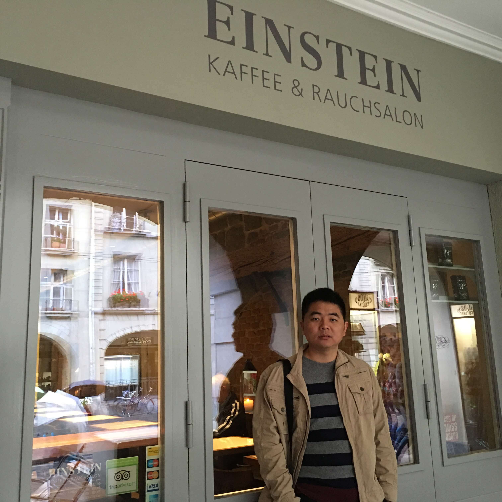

- 🩷找到了一个比较大模型的网站 context.ai
- TODO 找时间深入研究这个网站 context.ai
  id:: 66a99f56-9359-4895-bee2-4e3f037b0e22
- DONE 用logseq方式完成ppt创建
  :LOGBOOK:
  CLOCK: [2024-07-31 Wed 10:28:12]--[2024-07-31 Wed 10:28:19] =>  00:00:07
  :END:
- 
	-
	-
- 看起来你在记录一些研究和工作进展。context.ai 是一个有趣的网站，提供了很多与大型模型相关的资源和工具。如果你需要深入研究，可以考虑探索它的文档、示例和应用场景，来更好地理解其功能和应用 /
- 测试一下block
  collapsed:: true
	-
	- mac中的moj指键盘上的哪个键？
		-
		- [[gpt3]]:
		  在Mac键盘上，“moj”并不是一个特定的键位。可能是指"Option"键，通常在键盘上标签为“⌥”，但具体的“moj”可能是某种拼音或缩写的变体。如果您可以提供更多上下文或详细信息，我将能够帮助您更具体地理解。
	-
	-
	- 一个非常漂亮的中国少女
		- 中国的美丽少女通常被描绘为优雅、温柔，具有独特的气质和风采。她们可能穿着传统服饰如汉服，展现出浓厚的文化底蕴，也可能穿着现代时尚的服装，体现出青春活力。她们的笑容、眼神和举止往往散发出自信与纯真，给人留下深刻的印象。在不同的地域和文化背景中，每个女孩都拥有自己的美丽，值得珍惜和赞美。
			-
			- [[gpt4o-mini]]:回应
			  确实，中国的美丽少女以其独特的气质和多样的风格令人瞩目。无论是穿着汉服的优雅之美，还是现代服饰所展现出的青春活力，都展现了她们丰富的内涵与个性。笑容和眼神是她们魅力的重要组成部分，反映了自信和纯真的内心世界。在不同的文化背景和地域风情中，每个女孩都呈现出不同的美丽，体现了多元文化的交融与包容，值得大家去欣赏和尊重。
			- [[gpt4o-mini]]:总结
			  中国的美丽少女被形容为优雅和温柔，具有独特气质。她们可能穿着传统汉服或现代时尚服装，展现文化底蕴和青春活力。其笑容和举止散发自信与纯真，各地区女孩的美丽各具特色，值得珍惜与赞美。
- 测试一下wisper !
  collapsed:: true
	- 我想测试一下这个log SQL的功能到底怎么样 请你给我来测试一下 同时告诉我测试的要点 谢谢
- 我想去湖北恩施旅游，请给我一个行程计划
  collapsed:: true
	- [[gpt4o-mini]]:
	  以下是一个为期四天的恩施旅游行程计划，希望能够帮助你更好地安排你的旅行。
	  
	  ### 第一天：恩施市区游
	  - **上午**：抵达恩施市，入住酒店，稍作休息后前往恩施大峡谷。
	    - **游览恩施大峡谷**：欣赏壮观的山水风光，可以徒步或选择景区内的观光车。
	  - **中午**：在景区内享用午餐，推荐当地特色菜肴如土家菜。
	  - **下午**：前往龙船水寨，了解土家族文化，欣赏特色的土家建筑和民俗表演。
	  - **晚上**：在恩施市区享用晚餐，推荐当地的火锅或酸鸭。
	  
	  ### 第二天：土家族文化体验
	  - **上午**：前往恩施土司城，深入了解土司文化和历史。
	  - **中午**：在土司城附近用午餐，品尝土家风味。
	  - **下午**：参观恩施大峡谷第二大景点——梭布垭石林，游览途中可以拍照留念。
	  - **晚上**：如有安排可观看民俗演出，感受土家族的歌舞文化。
	  
	  ### 第三天：自然风光探索
	  - **上午**：前往宣恩县的桃花源，享受灵秀的自然风光和宁静的环境。
	  - **中午**：在当地餐厅享用午餐，尝试一些农家菜。
	  - **下午**：游览鹤峰的四渡河风景区，可以进行漂流活动（视季节而定）。
	  - **晚上**：返回恩施市，享受晚餐，推荐土家腊肉或米酒。
	  
	  ### 第四天：乡村游和购物
	  - **上午**：前往恩施乡村，体验当地人的生活，可选择徒步或骑行。
	  - **中午**：在乡村享用农家午餐，体验当地的农村特色饮食。
	  - **下午**：返回市区，逛一逛当地的手工艺品市场，购买一些土家特色的小礼品。
	  - **晚上**：准备离开，可以选择在当地品尝一些特色小吃作告别。
	  
	  ### 注意事项：
	  - 行程可根据个人兴趣调整。
	  - 建议了解当地气候，准备合适的衣物。
	  - 提前预定景区门票和酒店，确保顺利旅行。
	  
	  希望这个行程计划能让你在恩施度过一个愉快的假期！
	-
- # Student Teacher Dialog
  prompt-template:: Student Teacher Dialog
	- ```prompt
	    Rewrite text as a dialog between a teacher and a student:
	  ```<!-- notionvc: 98cd37e0-0a82-423c-8007-d24691284882 -->
	-
	-
-
- 奥运会中国队得了几块金牌？
  collapsed:: true
	- [[gpt4o-mini]]:
	  截至2021年东京奥运会，中国队获得了38枚金牌。具体的金牌数量在每届奥运会后会有所不同，请关注最新的比赛信息以获取最新数据。
- 现在的时间是？
  collapsed:: true
	- [[gpt4o-mini]]:
	  抱歉，我无法提供实时的时间信息。你可以查看设备上的时钟来获取当前时间。
-
- /gpt-page 4o-mini的总结：
- “GPT-4o Mini”是一种小型的语言模型，旨在提供高效的文本生成和理解能力。其主要特点包括：
  
  1. **模型精简**：相较于全尺寸的GPT-4，Mini版在参数量和计算需求上有所减少，适合资源有限的环境中使用。
  
  2. **快速响应**：由于模型较小，响应时间更快，适合实时应用场景。
  
  3. **依然强大**：尽管精简，仍保持了相对较强的语言理解与生成能力，能够处理多种任务，如对话、文本总结和翻译等。
  
  4. **应用广泛**：适用于个人助手、教育工具以及轻量级的内容创作等场景。
  
  在使用中，用户可根据具体需求选择这款模型，以获得高效且经济的文本处理解决方案。
-